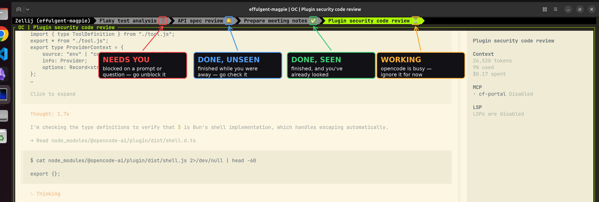
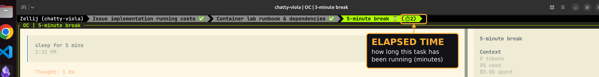

# opencode-zellij-indicator

**Know which of your OpenCode agents needs you — without switching tabs.**

When you run several [OpenCode](https://opencode.ai) sessions across
[Zellij](https://zellij.dev) tabs, they all look identical. You can't see which
one is still grinding, which is silently waiting for you to approve something,
and which finished five minutes ago. So you keep clicking through them.

## The five states

| Icon | When | What it means for you |
|------|------|-----------------------|
| ⏳ | working | OpenCode is busy — ignore it for now |
| 🔁 | retrying | a request failed; OpenCode is backing off and retrying — usually nothing to do |
| ❓ | needs you | blocked on a permission prompt or a question — go unblock it |
| 🔔 | done, unseen | it finished while you were away — go check the result |
| ✅ | done, seen | finished, and you've already looked |

## Example



## Naming

OpenCode gives each session an auto-generated title, and the plugin uses that as the Zellij tab name. To change it, run OpenCode's built-in `/rename` slash command.

## Install

**1. Install Zellij and OpenCode.**  
Requires Zellij ≥ 0.44.0

**2. Enable the plugin.**   
Add the following to your `opencode.json`
```json
{
  "plugin": ["opencode-zellij-indicator"]
}
```
Outside Zellij the plugin does nothing (it exits immediately), so it's safe to leave enabled everywhere at no cost.

**3. Run OpenCode inside Zellij.**
```sh
zellij      # opens the Zellij workspace
opencode    # run this inside Zellij
```

That single tab now shows OpenCode's status. To feel the point of the plugin,
open more tabs and run OpenCode in each — press `Ctrl t` then `n` for a new
tab (`Ctrl t` then the arrow keys to switch between them).

### Agent Setup 
Prefer to let an agent do it? Copy this into your prompt:
```
Fetch https://raw.githubusercontent.com/aidan-gallagher/opencode-zellij-indicator/master/docs/agent-setup.md and follow the setup steps.
```

## Configuration

Set these as [environment variables](https://askubuntu.com/questions/730/how-do-i-set-environment-variables) before launching OpenCode.

### Stopwatch

`OPENCODE_ZELLIJ_STOPWATCH=1`   
Show how long a session has been running. After a minute, the elapsed minutes appear next to the icon:



### Sound

`OPENCODE_ZELLIJ_SOUND=1`   
Play a sound when OpenCode finishes in a background tab.

`OPENCODE_ZELLIJ_SOUND_CMD="pw-play ~/alert.wav"`  
Override the default sound with your own command.
