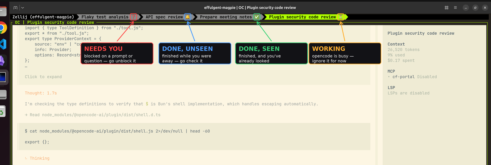

# opencode-zellij-indicator

**Know which of your opencode agents needs you — without switching tabs.**

When you run several [opencode](https://opencode.ai) sessions across
[Zellij](https://zellij.dev) tabs, they all look identical. You can't see which
one is still grinding, which is silently waiting for you to approve something,
and which finished five minutes ago. So you keep clicking through them.

## The four states

| Icon | When | What it means for you |
|------|------|-----------------------|
| ⏳ | working | opencode is busy — ignore it for now |
| ❓ | needs you | blocked on a permission prompt or a question — go unblock it |
| 🔔 | done, unseen | it finished while you were away — go check the result |
| ✅ | done, seen | finished, and you've already looked |

## Example




## Install

**1. Install Zellij and OpenCode**

**2. Enable the plugin.**   
Add the following to your `opencode.json`
```json
{
  "plugin": ["opencode-zellij-indicator"]
}
```

**3. Run opencode inside Zellij.**
```sh
zellij      # opens the Zellij workspace
opencode    # run this inside Zellij
```

That single tab now shows opencode's status. To feel the point of the plugin,
open more tabs and run an opencode in each — press `Ctrl t` then `n` for a new
tab (`Ctrl t` then the arrow keys to switch between them). The tab bar becomes
your dashboard: ⏳ busy, ❓ waiting on you, 🔔 done, ✅ handled.

